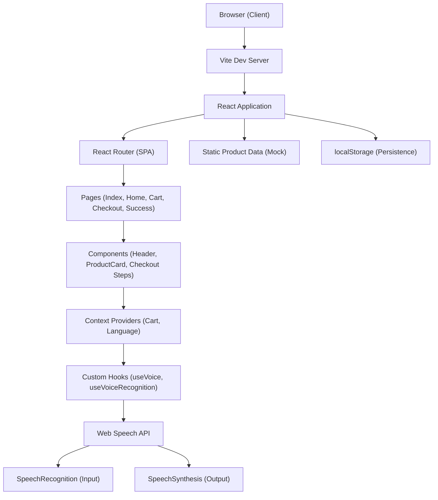
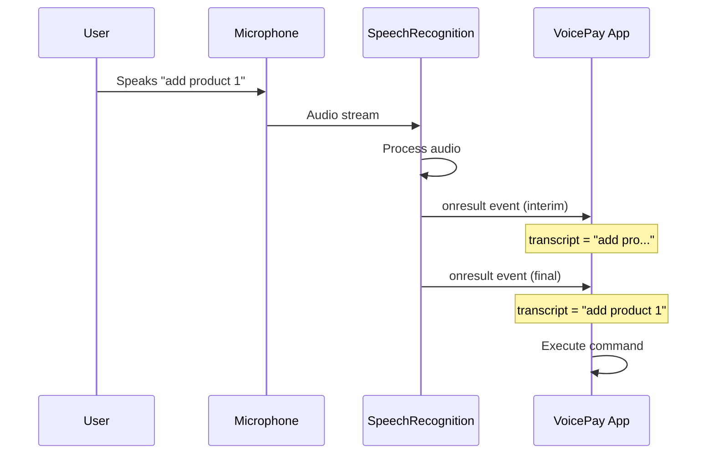
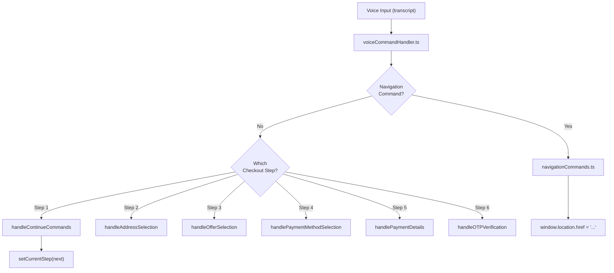
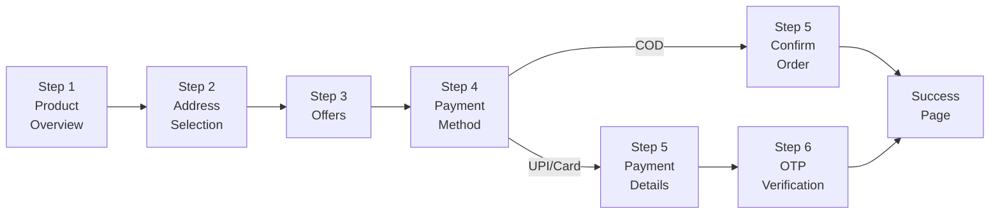

# VoicePay — Comprehensive Study Guide

> A deep-dive study guide into the **VoicePay** project — an AI-powered, voice-first accessible e-commerce platform built with React, TypeScript, and the Web Speech API.

---

## Table of Contents

1. [Project Overview & Architecture](#1-project-overview--architecture)
2. [Tech Stack Deep Dive](#2-tech-stack-deep-dive)
3. [Project Structure & File Organization](#3-project-structure--file-organization)
4. [Application Entry Point & Bootstrapping](#4-application-entry-point--bootstrapping)
5. [Routing & Navigation](#5-routing--navigation)
6. [TypeScript Type System](#6-typescript-type-system)
7. [State Management with React Context API](#7-state-management-with-react-context-api)
8. [Web Speech API — The Core Innovation](#8-web-speech-api--the-core-innovation)
9. [Custom Hooks Architecture](#9-custom-hooks-architecture)
10. [Voice Command Processing Pipeline](#10-voice-command-processing-pipeline)
11. [Component Architecture & Patterns](#11-component-architecture--patterns)
12. [Checkout Flow — Step-by-Step Breakdown](#12-checkout-flow--step-by-step-breakdown)
13. [Internationalization (i18n) & Multilingual Support](#13-internationalization-i18n--multilingual-support)
14. [Styling Architecture — Tailwind CSS & shadcn/ui](#14-styling-architecture--tailwind-css--shadcnui)
15. [Data Layer & Mock Backend](#15-data-layer--mock-backend)
16. [Accessibility Patterns](#16-accessibility-patterns)
17. [Build Tooling — Vite & TypeScript Configuration](#17-build-tooling--vite--typescript-configuration)
18. [Key Design Patterns Used](#18-key-design-patterns-used)
19. [Important Terminologies & Glossary](#19-important-terminologies--glossary)

---

## 1. Project Overview & Architecture

### What is VoicePay?

VoicePay is a **frontend-only** accessible e-commerce web application that allows users to complete the entire shopping and checkout process using **voice commands**. It is designed specifically for users with **visual, motor, or cognitive disabilities**, making online shopping inclusive and hands-free.

### High-Level Architecture



### Key Architectural Decisions

| Decision | Rationale |
|---|---|
| **Frontend-only** (no backend) | Simplifies deployment; all payment behavior is mocked/simulated |
| **React Context** over Redux | Application state is small enough that Context API is sufficient — avoids unnecessary complexity |
| **Web Speech API** (browser-native) | No external speech service dependency; works offline after page load |
| **shadcn/ui** component library | Pre-built, accessible, customizable UI primitives based on Radix UI |
| **Vite** over CRA/Webpack | Extremely fast HMR (Hot Module Replacement) and build times using esbuild |
| **TypeScript** | Type safety across the entire codebase; especially useful for voice command type definitions |

---

## 2. Tech Stack Deep Dive

### Core Technologies

| Technology | Role | Version |
|---|---|---|
| **React 18** | UI framework | ^18.3.1 |
| **TypeScript** | Type-safe JavaScript | ^5.5.3 |
| **Vite** | Build tool & dev server | ^5.4.1 |
| **React Router DOM** | Client-side routing | ^6.26.2 |
| **Tailwind CSS** | Utility-first CSS | ^3.4.11 |
| **shadcn/ui** | Component library (Radix-based) | N/A (installed per-component) |
| **TanStack React Query** | Server-state management | ^5.56.2 |
| **Zod** | Schema validation | ^3.23.8 |
| **Lucide React** | Icon library | ^0.462.0 |
| **Sonner** | Toast notifications | ^1.5.0 |
| **Web Speech API** | Browser-native speech I/O | Built-in |

### Why These Choices Matter

**React 18** introduces concurrent features and automatic batching — important for performance when handling rapid voice input events.

**Vite** uses **esbuild** for transpilation (10–100x faster than Webpack), and supports native ES modules during development. This means the browser loads modules directly without bundling during development, resulting in near-instant startup:

```typescript
// vite.config.ts — Compact Vite configuration
export default defineConfig(({ mode }) => ({
  server: {
    host: "::",    // Listen on all interfaces (IPv4 + IPv6)
    port: 8080,
  },
  plugins: [
    react(),       // Uses SWC instead of Babel for even faster transforms
  ],
  resolve: {
    alias: {
      "@": path.resolve(__dirname, "./src"),  // Path alias for clean imports
    },
  },
}));
```

The **`@` path alias** is critical. Instead of writing `../../components/Header`, you write `@/components/Header`. This is configured in three places that must stay in sync:
1. `vite.config.ts` — for the bundler
2. `tsconfig.json` — for TypeScript compiler
3. `components.json` — for shadcn/ui CLI

---

## 3. Project Structure & File Organization

```
Voice_Pay/
├── public/                    # Static assets served as-is
├── src/
│   ├── components/            # Reusable UI components
│   │   ├── ui/                # shadcn/ui primitives (Button, Card, Input, etc.)
│   │   ├── checkout/          # Checkout-specific components (21 files)
│   │   │   ├── AddressStep.tsx
│   │   │   ├── CardPaymentForm.tsx
│   │   │   ├── CheckoutHeader.tsx
│   │   │   ├── CheckoutNavigation.tsx
│   │   │   ├── CheckoutSteps.tsx          # Step orchestrator
│   │   │   ├── OTPVerificationStep.tsx
│   │   │   ├── OTPVerificationForm.tsx
│   │   │   ├── OTPActionButtons.tsx
│   │   │   ├── OTPManualInput.tsx
│   │   │   ├── OTPSecurityInfo.tsx
│   │   │   ├── OTPVoiceInstructions.tsx
│   │   │   ├── OffersSection.tsx
│   │   │   ├── OrderSummary.tsx
│   │   │   ├── PaymentDetailsStep.tsx
│   │   │   ├── PaymentMethodStep.tsx
│   │   │   ├── ProductOverview.tsx
│   │   │   ├── SavedAddressList.tsx
│   │   │   ├── UPIPaymentForm.tsx
│   │   │   ├── VerificationStep.tsx
│   │   │   ├── VoiceInstructions.tsx
│   │   │   └── VoiceStatusIndicator.tsx
│   │   ├── Header.tsx          # Global navigation header
│   │   ├── LanguageSelector.tsx # Voice-driven language picker
│   │   ├── ProductCard.tsx     # Product display card
│   │   └── VoiceButton.tsx     # Reusable mic button
│   ├── context/               # React Context providers
│   │   ├── CartContext.tsx     # Shopping cart state
│   │   └── LanguageContext.tsx # Language & translation state
│   ├── data/                  # Static/mock data
│   │   └── products.ts        # Product catalog (20 products)
│   ├── hooks/                 # Custom React hooks
│   │   ├── useVoice.ts        # Basic speech synthesis + recognition
│   │   ├── useVoiceRecognition.ts  # Advanced continuous recognition
│   │   ├── use-mobile.tsx     # Responsive breakpoint detection
│   │   └── use-toast.ts       # Toast notification system
│   ├── lib/                   # Utility libraries
│   │   └── utils.ts           # cn() class merge utility
│   ├── pages/                 # Route-level page components
│   │   ├── Index.tsx          # Entry page (language selector → Home)
│   │   ├── Home.tsx           # Product listing page
│   │   ├── Cart.tsx           # Shopping cart page
│   │   ├── Checkout.tsx       # Multi-step checkout orchestrator
│   │   ├── Success.tsx        # Order confirmation page
│   │   ├── About.tsx          # About page
│   │   ├── OurAim.tsx         # Mission/vision page
│   │   └── NotFound.tsx       # 404 page
│   ├── types/                 # TypeScript type definitions
│   │   ├── product.ts         # Product, CartItem, CheckoutData
│   │   ├── speech.d.ts        # Web Speech API type augmentations
│   │   └── voiceCommand.ts    # Voice command handler types
│   ├── utils/                 # Business logic utilities
│   │   ├── voiceCommandHandler.ts  # Central voice command router
│   │   └── commands/          # Modular command handlers
│   │       ├── navigationCommands.ts
│   │       ├── checkoutCommands.ts
│   │       └── paymentCommands.ts
│   ├── App.tsx                # Root component with providers
│   ├── App.css                # App-level styles
│   ├── main.tsx               # React DOM entry point
│   └── index.css              # Global styles & CSS custom properties
├── index.html                 # HTML entry point with SEO meta tags
├── package.json               # Dependencies & scripts
├── tailwind.config.ts         # Tailwind CSS configuration
├── tsconfig.json              # TypeScript base configuration
├── tsconfig.app.json          # App-specific TS config
├── vite.config.ts             # Vite bundler configuration
└── components.json            # shadcn/ui configuration
```

### Why This Structure Matters

The project follows a **feature-based organization** within the components directory. The `checkout/` folder contains 21 sub-components, each responsible for a single piece of the checkout flow. This demonstrates the **Single Responsibility Principle** — each component does one thing well.

The separation of `hooks/`, `context/`, `types/`, and `utils/` follows a **layered architecture** pattern:
- **Types** → define the shape of data
- **Context** → manages global state
- **Hooks** → encapsulate reusable logic
- **Utils** → pure functions for business logic
- **Components** → render UI using all of the above

---

## 4. Application Entry Point & Bootstrapping

### The Boot Sequence

The application boots through a clear chain:


#### `index.html` — The HTML Shell

```html
<body>
  <div id="root"></div>
  <script type="module" src="/src/main.tsx"></script>
</body>
```

The `type="module"` attribute tells the browser to treat the script as an ES module, enabling Vite's native ESM-based development workflow.

#### `main.tsx` — React DOM Entry

```typescript
import { createRoot } from 'react-dom/client';
import App from './App.tsx';
import './index.css';

createRoot(document.getElementById("root")!).render(<App />);
```

Key points:
- Uses React 18's `createRoot` API (not the legacy `ReactDOM.render`)
- The `!` is TypeScript's **non-null assertion operator** — it tells the compiler "I guarantee `getElementById('root')` won't be null"
- `index.css` is imported here so Tailwind's base styles apply globally

#### `App.tsx` — The Provider Stack

```tsx
const App = () => (
  <QueryClientProvider client={queryClient}>
    <TooltipProvider>
      <Toaster />
      <Sonner />
      <LanguageProvider>
        <CartProvider>
          <BrowserRouter>
            <div className="min-h-screen">
              <Header />
              <Routes>
                <Route path="/" element={<Index />} />
                <Route path="/cart" element={<Cart />} />
                <Route path="/checkout" element={<Checkout />} />
                <Route path="/success" element={<Success />} />
                <Route path="/our-aim" element={<OurAim />} />
                <Route path="/about" element={<About />} />
                <Route path="*" element={<NotFound />} />
              </Routes>
            </div>
          </BrowserRouter>
        </CartProvider>
      </LanguageProvider>
    </TooltipProvider>
  </QueryClientProvider>
);
```

### Understanding the Provider Order

The **nesting order of providers matters**. Each inner provider can access the outer provider's values. Here's why this specific order is used:

1. **`QueryClientProvider`** — outermost because React Query is independent of app state
2. **`TooltipProvider`** — shadcn/ui requirement; wraps all components using tooltips
3. **`LanguageProvider`** — language must be available before cart (cart might need translations)
4. **`CartProvider`** — shopping cart state needs language for voice feedback
5. **`BrowserRouter`** — routes need access to both cart and language contexts

The `<Toaster />` and `<Sonner />` components are **portal-based** — they render floating toast notifications outside the normal DOM flow, which is why they can be placed at the top without affecting layout.

---

## 5. Routing & Navigation

### React Router v6 Configuration

VoicePay uses **React Router DOM v6** with a flat route structure (no nested routes):

```tsx
<Routes>
  <Route path="/" element={<Index />} />
  <Route path="/cart" element={<Cart />} />
  <Route path="/checkout" element={<Checkout />} />
  <Route path="/success" element={<Success />} />
  <Route path="/our-aim" element={<OurAim />} />
  <Route path="/about" element={<About />} />
  <Route path="*" element={<NotFound />} />
</Routes>
```

| Route | Page Component | Purpose |
|---|---|---|
| `/` | `Index` → `LanguageSelector` or `Home` | Entry gate: language selection, then product catalog |
| `/cart` | `Cart` | Shopping cart with quantity management |
| `/checkout` | `Checkout` | 6-step voice checkout process |
| `/success` | `Success` | Order confirmation with voice announcement |
| `/our-aim` | `OurAim` | Mission/vision page |
| `/about` | `About` | About the platform |
| `*` | `NotFound` | Catch-all 404 |

### Programmatic Navigation

The project uses two different patterns for navigation:

**Pattern 1: React Router's `useNavigate` hook** (recommended)

```typescript
const navigate = useNavigate();

// Navigate to cart
navigate('/cart');

// Navigate with state (used for passing order data to Success page)
navigate('/success', { state: orderData });
```

**Pattern 2: Direct `window.location.href`** (used in voice commands)

```typescript
// In navigationCommands.ts
window.location.href = '/cart';
```

The voice command handlers use `window.location.href` instead of React Router's `navigate` because the command handler functions are **pure utility functions** that don't have access to React hooks. This causes a full page reload (which is a minor trade-off for architectural simplicity).

### The Index Page — Conditional Rendering Gateway

The `Index` page acts as a **gateway** that conditionally shows either the `LanguageSelector` or the `Home` page:

```tsx
const Index = () => {
  const [languageSelected, setLanguageSelected] = useState(false);

  // Always show language selector on fresh load
  useEffect(() => {
    localStorage.removeItem('voicepay-language');
    setLanguageSelected(false);
  }, []);

  if (!languageSelected) {
    return <LanguageSelector onLanguageSelected={() => setLanguageSelected(true)} />;
  }

  return <Home />;
};
```

This pattern is called a **conditional render gate**. The language selector is the first thing every user sees, emphasizing the voice-first experience.

---

## 6. TypeScript Type System

### Product Types (`types/product.ts`)

```typescript
export interface Product {
  id: number;
  title: string;
  price: number;
  image: string;
  description: string;
  category: string;
  rating: {
    rate: number;
    count: number;
  };
}

export interface CartItem extends Product {
  quantity: number;
}

export interface CheckoutData {
  address: string;
  paymentMethod: 'UPI' | 'Card' | 'Cash on Delivery' | '';
  otp: string;
  voiceConfirmed: boolean;
}
```

Key concepts:

- **`interface` vs `type`**: Interfaces are used here because they are extendable. `CartItem extends Product` adds a `quantity` field while inheriting all `Product` fields. This is called **interface inheritance**.

- **Union Types**: `paymentMethod: 'UPI' | 'Card' | 'Cash on Delivery' | ''` restricts the payment method to exactly these four string values. TypeScript will error if you try to assign any other string. The `''` (empty string) represents the initial unselected state.

- **Nested Object Types**: `rating` is an inline object type. This avoids creating a separate interface for a small, non-reusable shape.

### Voice Command Types (`types/voiceCommand.ts`)

```typescript
export interface PaymentDetails {
  upiAddress: string;
  cardHolderName: string;
  cardNumber: string;
  cvv: string;
}

export interface VoiceCommandHandlerProps {
  transcript: string;
  currentStep: number;
  paymentMethod: string;
  paymentDetails: PaymentDetails;
  language: string;
  setPaymentMethod: (method: string) => void;
  setPaymentDetails: (details: PaymentDetails | ((prev: PaymentDetails) => PaymentDetails)) => void;
  setOtp: (otp: string) => void;
  setCurrentStep: (step: number) => void;
  speak: (text: string) => void;
  selectedAddressIndex: number;
  setSelectedAddressIndex: (index: number) => void;
}
```

Key concepts:

- **Function Types in Interfaces**: `setPaymentMethod: (method: string) => void` defines a function that takes a string and returns nothing. This is how you type React state setters.

- **Union Function Types**: `setPaymentDetails: (details: PaymentDetails | ((prev: PaymentDetails) => PaymentDetails)) => void` — This matches React's `useState` setter signature. It accepts either a direct value OR a function that receives the previous state. This allows both:
  ```typescript
  setPaymentDetails({ upiAddress: 'test@upi', ... });           // Direct value
  setPaymentDetails(prev => ({ ...prev, upiAddress: 'test@upi' })); // Functional update
  ```

### Web Speech API Type Augmentations (`types/speech.d.ts`)

The Web Speech API is not fully typed in TypeScript's standard library. This file **augments the global Window interface** to include speech recognition types:

```typescript
declare global {
  interface Window {
    SpeechRecognition: typeof SpeechRecognition;
    webkitSpeechRecognition: typeof SpeechRecognition;
  }
}
```

The `declare global` block extends the existing `Window` interface without modifying it directly. The `webkitSpeechRecognition` property is needed because Chrome and Safari use the vendor-prefixed version.

The full type definitions for `SpeechRecognition`, `SpeechRecognitionEvent`, `SpeechRecognitionResult`, and `SpeechRecognitionAlternative` provide autocomplete and type checking for all speech API interactions:

```typescript
interface SpeechRecognitionResult {
  readonly length: number;
  item(index: number): SpeechRecognitionAlternative;
  [index: number]: SpeechRecognitionAlternative;  // Array-like access
  isFinal: boolean;                                // Key: was this the final result?
}

interface SpeechRecognitionAlternative {
  transcript: string;   // The recognized text
  confidence: number;   // 0.0 to 1.0 confidence score
}
```

The `export {}` at the bottom is crucial — it makes this file a **module** rather than a **script**, which is required for `declare global` to work properly in TypeScript.

---

## 7. State Management with React Context API

### CartContext — Shopping Cart State

The `CartContext` manages the entire shopping cart state using the **Provider Pattern**:

```typescript
interface CartContextType {
  cartItems: CartItem[];
  addToCart: (product: Product) => void;
  removeFromCart: (productId: number) => void;
  updateQuantity: (productId: number, quantity: number) => void;
  clearCart: () => void;
  getTotalPrice: () => number;
  getTotalItems: () => number;
}
```

#### Creating the Context

```typescript
const CartContext = createContext<CartContextType | undefined>(undefined);
```

The initial value is `undefined` — this is intentional. It forces consumers to use the `useCart` hook (which throws an error if used outside the provider) rather than accidentally getting a default value.

#### The Provider Component

```typescript
export const CartProvider: React.FC<{ children: React.ReactNode }> = ({ children }) => {
  const [cartItems, setCartItems] = useState<CartItem[]>([]);

  // Load cart from localStorage on mount
  useEffect(() => {
    const savedCart = localStorage.getItem('voicepay-cart');
    if (savedCart) {
      setCartItems(JSON.parse(savedCart));
    }
  }, []);

  // Persist cart to localStorage on every change
  useEffect(() => {
    localStorage.setItem('voicepay-cart', JSON.stringify(cartItems));
  }, [cartItems]);

  // ... cart operations ...
};
```

This implements **localStorage persistence** — the cart survives page refreshes. The two `useEffect` hooks work together:
1. **Mount effect** (`[]` dependency): loads saved cart once on component mount
2. **Sync effect** (`[cartItems]` dependency): saves cart whenever it changes

#### Smart Add-to-Cart Logic

```typescript
const addToCart = (product: Product) => {
  setCartItems(prev => {
    const existingItem = prev.find(item => item.id === product.id);
    if (existingItem) {
      // Item exists → increment quantity
      return prev.map(item =>
        item.id === product.id
          ? { ...item, quantity: item.quantity + 1 }
          : item
      );
    }
    // New item → add with quantity 1
    return [...prev, { ...product, quantity: 1 }];
  });
};
```

This uses the **functional updater pattern** (`setCartItems(prev => ...)`) instead of directly setting state. This is critical when the new state depends on the previous state, ensuring no race conditions with rapid voice commands.

#### The Consumer Hook

```typescript
export const useCart = () => {
  const context = useContext(CartContext);
  if (context === undefined) {
    throw new Error('useCart must be used within a CartProvider');
  }
  return context;
};
```

This is the **custom hook + guard pattern**. The hook provides:
1. Type-safe access to cart state
2. Runtime validation that the provider exists
3. Clean API for consumers: `const { addToCart, cartItems } = useCart();`

### LanguageContext — Internationalization State

```typescript
type Language = 'en' | 'hi';

interface LanguageContextType {
  language: Language;
  setLanguage: (lang: Language) => void;
  t: (key: string) => string;          // Translation function
}
```

The `t` function (short for "translate") uses **dot-notation key lookup** in a translations object:

```typescript
const t = (key: string): string => {
  const keys = key.split('.');
  let value: any = translations[language];
  
  for (const k of keys) {
    value = value?.[k];
  }
  
  return value || key;   // Fallback to key if translation not found
};
```

Usage: `t('cart.title')` → `"Shopping Cart"` (en) or `"शॉपिंग कार्ट"` (hi)

The `?.` is the **optional chaining operator**. If `value` is `null` or `undefined` at any point in the chain, it short-circuits and returns `undefined` instead of throwing an error. The `|| key` fallback means missing translations show the key itself, making it easy to spot untranslated strings during development.

---

## 8. Web Speech API — The Core Innovation

The Web Speech API is the heart of VoicePay. It consists of two independent browser APIs:

### SpeechRecognition (Voice Input)

Converts spoken words into text. This is what powers voice commands.



#### Key Configuration Options

```typescript
const SpeechRecognition = window.SpeechRecognition || window.webkitSpeechRecognition;
const recognition = new SpeechRecognition();

recognition.continuous = true;        // Keep listening after each result
recognition.interimResults = true;    // Get partial results as user speaks
recognition.lang = 'en-IN';          // Language for recognition
recognition.maxAlternatives = 1;     // Number of alternative transcriptions
```

- **`continuous: true`** means the recognition engine doesn't stop after the first result. This is essential for a hands-free experience — the user doesn't need to re-activate the microphone.
- **`interimResults: true`** provides real-time feedback as the user speaks. Interim results update the "You said:" display, giving visual confirmation before the final result is processed.

#### Processing Results

```typescript
rec.onresult = (event: any) => {
  let finalTranscript = '';
  let interimTranscript = '';
  
  for (let i = event.resultIndex; i < event.results.length; i++) {
    const transcript = event.results[i][0].transcript;
    if (event.results[i].isFinal) {
      finalTranscript += transcript;
    } else {
      interimTranscript += transcript;
    }
  }
  
  // Show interim results for visual feedback
  setCurrentTranscript(finalTranscript || interimTranscript);
  
  // Only process final results
  if (finalTranscript.trim()) {
    onVoiceCommand(finalTranscript.trim());
  }
};
```

The `event.results` is a **nested array-like structure**:
- `event.results[i]` — the i-th result (may contain multiple alternatives)
- `event.results[i][0]` — the most confident alternative
- `event.results[i][0].transcript` — the recognized text
- `event.results[i].isFinal` — whether this is a final or interim result

### SpeechSynthesis (Voice Output)

Converts text into spoken audio. This is what provides voice feedback to the user.

```typescript
const speak = useCallback((text: string) => {
  if ('speechSynthesis' in window) {
    speechInProgressRef.current = true;
    window.speechSynthesis.cancel();    // Cancel any ongoing speech
    
    const utterance = new SpeechSynthesisUtterance(text);
    
    if (language === 'hi') {
      utterance.lang = 'hi-IN';       // Hindi voice
      utterance.rate = 0.8;            // Slower for Hindi
    } else {
      utterance.lang = 'en-IN';       // Indian English voice
      utterance.rate = 0.9;
    }
    
    utterance.volume = 0.9;
    
    return new Promise<void>((resolve) => {
      utterance.onend = () => {
        speechInProgressRef.current = false;
        resolve();
      };
      utterance.onerror = () => {
        speechInProgressRef.current = false;
        resolve();
      };
      window.speechSynthesis.speak(utterance);
    });
  }
  return Promise.resolve();
}, [language]);
```

Key techniques:

1. **`window.speechSynthesis.cancel()`** — always cancel ongoing speech before starting new speech. Without this, speech utterances queue up and overlap.

2. **Promise wrapping** — the `speak` function returns a `Promise` that resolves when speech ends. This enables `await speak("Hello")` for sequential speech, ensuring voice instructions finish before recognition begins.

3. **`speechInProgressRef`** — a React ref that tracks whether speech is currently playing. Recognition is suppressed while speech is active to prevent the microphone from picking up the computer's own voice output (feedback loop prevention).

### Browser Compatibility

The Web Speech API has varying browser support:

| Feature | Chrome | Firefox | Safari | Edge |
|---|---|---|---|---|
| SpeechRecognition | ✅ (webkit prefix) | ❌ | ✅ (webkit prefix) | ✅ |
| SpeechSynthesis | ✅ | ✅ | ✅ | ✅ |

The codebase handles this with a **feature detection pattern**:

```typescript
if (!('webkitSpeechRecognition' in window) && !('SpeechRecognition' in window)) {
  // Fallback behavior
  setIsSupported(false);
  toast({
    title: "Speech Recognition Not Supported",
    description: "Please use a modern browser or enter text manually.",
    variant: "destructive",
  });
  return;
}

const SpeechRecognition = window.SpeechRecognition || window.webkitSpeechRecognition;
```

This checks for both the standard and webkit-prefixed versions, gracefully degrading with a user-friendly error message if neither is available.

---

## 9. Custom Hooks Architecture

### `useVoice` — Basic Voice Hook

The simpler of the two voice hooks, providing basic listen/speak functionality:

```typescript
export const useVoice = (options: VoiceHookOptions = {}) => {
  const [isListening, setIsListening] = useState(false);
  const [isSupported, setIsSupported] = useState(true);
  const { toast } = useToast();

  const speak = useCallback((text: string): Promise<void> => { /* ... */ }, []);
  const listen = useCallback(() => { /* ... */ }, [options, toast]);
  const stopListening = useCallback(() => { setIsListening(false); }, []);

  return { isListening, isSupported, speak, listen, stopListening };
};
```

The `useCallback` hook **memoizes** functions so they maintain referential equality across renders. This prevents unnecessary re-renders of child components that receive these functions as props.

### `useVoiceRecognition` — Advanced Continuous Recognition Hook

This is the most complex hook in the codebase. It manages **continuous, auto-restarting** voice recognition with several important concurrency controls:

```typescript
export const useVoiceRecognition = ({ voiceMode, currentStep, onVoiceCommand }) => {
  const { language } = useLanguage();
  const [isListening, setIsListening] = useState(false);
  const [currentTranscript, setCurrentTranscript] = useState('');
  
  // Refs for managing async state (not causing re-renders)
  const recognitionRef = useRef<any>(null);
  const isActiveRef = useRef(false);
  const processingRef = useRef(false);
  const speechInProgressRef = useRef(false);
  
  // ... implementation ...
  
  return {
    isListening,
    currentTranscript,
    awaitingConfirmation: false,
    speak,
    recognition: recognitionRef.current
  };
};
```

#### Why Refs Instead of State?

The four `useRef` values are used instead of `useState` because:

1. **No re-renders needed**: These values change rapidly during voice processing. Using `useState` would trigger dozens of unnecessary re-renders per second.
2. **Immediate availability**: `useRef` values update synchronously. `useState` updates are batched and asynchronous — a voice event handler might read stale state.
3. **Stable identity**: Refs maintain the same object reference across renders, critical for the recognition event handlers that close over these values.

#### Auto-Restart Logic

The recognition is designed to **automatically restart** after each recognition session ends, creating a continuous listening experience:

```typescript
rec.onend = () => {
  setIsListening(false);
  
  // Only restart if still in voice mode and not processing
  if (voiceMode && isActiveRef.current && !processingRef.current && !speechInProgressRef.current) {
    setTimeout(() => {
      if (voiceMode && isActiveRef.current && !processingRef.current && !speechInProgressRef.current) {
        startRecognition();  // Recursive restart
      }
    }, 1000);
  }
};
```

The 1-second delay prevents rapid restart loops. The quadruple condition check prevents starting recognition when:
- Voice mode is off
- Recognition was explicitly stopped
- A voice command is being processed
- The app is currently speaking (preventing feedback loops)

#### Cleanup on Unmount

```typescript
useEffect(() => {
  return () => {
    stopRecognition();
    window.speechSynthesis.cancel();
  };
}, [stopRecognition]);
```

This cleanup function runs when the component unmounts, preventing:
- **Orphaned recognition**: A background `SpeechRecognition` instance continuing to consume microphone resources
- **Orphaned speech**: Ongoing speech synthesis continuing after the user navigates away

### `useIsMobile` — Responsive Detection Hook

```typescript
const MOBILE_BREAKPOINT = 768;

export function useIsMobile() {
  const [isMobile, setIsMobile] = React.useState<boolean | undefined>(undefined);

  React.useEffect(() => {
    const mql = window.matchMedia(`(max-width: ${MOBILE_BREAKPOINT - 1}px)`);
    const onChange = () => {
      setIsMobile(window.innerWidth < MOBILE_BREAKPOINT);
    };
    mql.addEventListener("change", onChange);
    setIsMobile(window.innerWidth < MOBILE_BREAKPOINT);
    return () => mql.removeEventListener("change", onChange);
  }, []);

  return !!isMobile;
}
```

This uses the **`matchMedia` API** instead of a resize event listener. `matchMedia` is more efficient because it only fires when the media query result actually changes (crossing the breakpoint), not on every pixel of resize.

The `!!isMobile` double-negation converts the `boolean | undefined` to a clean `boolean` (since `!undefined` is `true`, `!!undefined` is `false`).

### `useToast` — External State Toast System

The toast hook implements an unusual pattern: **state management outside React**:

```typescript
const listeners: Array<(state: State) => void> = [];
let memoryState: State = { toasts: [] };

function dispatch(action: Action) {
  memoryState = reducer(memoryState, action);
  listeners.forEach((listener) => {
    listener(memoryState);
  });
}
```

This is a **mini pub/sub system**. The `memoryState` lives outside React's component tree, allowing the `toast()` function to be called from anywhere — even from non-component code like utility functions. Each component that uses `useToast()` subscribes to state changes via the `listeners` array.

---

## 10. Voice Command Processing Pipeline

### Architecture Overview

The voice command system follows a **chain of responsibility pattern** where commands flow through increasingly specific handlers:



### Central Router (`voiceCommandHandler.ts`)

```typescript
export const handleVoiceCommand = (props: VoiceCommandHandlerProps) => {
  const { transcript, currentStep } = props;

  // 1. Global navigation commands always checked first
  if (handleNavigationCommands(transcript)) {
    return;
  }

  // 2. Step-specific command routing
  switch (currentStep) {
    case 1: handleContinueCommands(props); break;
    case 2:
      if (!handleAddressSelection(props)) {
        handleContinueCommands(props);
      }
      break;
    // ... more cases
  }
};
```

The early return on `handleNavigationCommands` means navigation commands like "go to cart" work from **any checkout step** — they have the highest priority.

### Navigation Commands — Bilingual Pattern Matching

```typescript
export const handleNavigationCommands = (transcript: string) => {
  const cleanTranscript = transcript.toLowerCase().trim();
  
  if (cleanTranscript.includes('home') || cleanTranscript.includes('होम') || 
      cleanTranscript.includes('back to home') || cleanTranscript.includes('main page')) {
    window.location.href = '/';
    return true;
  }
  
  if (cleanTranscript.includes('cart') || cleanTranscript.includes('कार्ट') || 
      cleanTranscript.includes('shopping cart') || cleanTranscript.includes('my cart')) {
    window.location.href = '/cart';
    return true;
  }
  // ... more patterns
  
  return false;  // No navigation matched
};
```

Every command handler follows this pattern:
1. **Normalize** the transcript (lowercase, trim)
2. **Match** against multiple phrasings (English + Hindi + common variations)
3. **Return boolean** to indicate if the command was handled

### Address Selection — Flexible Voice Matching

```typescript
export const handleAddressSelection = ({
  transcript,
  setSelectedAddressIndex,
  setCurrentStep
}: Pick<VoiceCommandHandlerProps, 'transcript' | 'setSelectedAddressIndex' | 'setCurrentStep'>) => {
  const cleanTranscript = transcript.toLowerCase().trim();
  
  // Matches: "address 1", "address1", "पता 1", "first", "पहला", "1", "one", "first address"
  if (cleanTranscript.includes('address 1') || cleanTranscript.includes('address1') ||
      cleanTranscript.includes('पता 1') || cleanTranscript.includes('पता1') ||
      cleanTranscript.includes('first') || cleanTranscript.includes('पहला') || 
      cleanTranscript === '1' || cleanTranscript === 'one' || 
      cleanTranscript.includes('first address')) {
    setSelectedAddressIndex(0);
    setTimeout(() => setCurrentStep(3), 1000);
    return true;
  }
  return false;
};
```

Key TypeScript concept: **`Pick<T, K>`** utility type. `Pick<VoiceCommandHandlerProps, 'transcript' | 'setSelectedAddressIndex' | 'setCurrentStep'>` creates a new type that only includes the specified properties from the full props type. This is better than passing the entire props object because:
1. It documents exactly which props the function needs
2. It prevents accidental access to props it shouldn't use
3. It makes the function easier to test in isolation

### Payment Details — Regex-Based Voice Parsing

```typescript
export const handlePaymentDetails = ({
  transcript,
  paymentMethod,
  paymentDetails,
  setPaymentDetails,
  setCurrentStep
}: Pick<VoiceCommandHandlerProps, ...>) => {
  
  if (paymentMethod === 'UPI') {
    const upiPatterns = [
      /[\w\.-]+@[\w\.-]+/,                    // General: name@provider
      /\d{10}@[\w\.-]+/,                      // Phone: 9876543210@upi
      /[\w]+@(paytm|phonepe|googlepay|bhim|upi)/i  // Known providers
    ];
    
    let upiMatch = null;
    for (const pattern of upiPatterns) {
      upiMatch = transcript.match(pattern);
      if (upiMatch) break;
    }
    
    if (upiMatch) {
      setPaymentDetails(prev => ({ ...prev, upiAddress: upiMatch[0] }));
      setTimeout(() => setCurrentStep(6), 1000);
      return true;
    }
  }
  
  else if (paymentMethod === 'Card') {
    const numbers = transcript.match(/\d+/g);
    
    // Sequence: name → card number → CVV
    if (!paymentDetails.cardHolderName && !transcript.match(/\d/)) {
      const nameWords = transcript.replace(/card holder|name|नाम|कार्ड धारक/gi, '').trim();
      if (nameWords.length > 2) {
        setPaymentDetails(prev => ({ ...prev, cardHolderName: nameWords }));
        return true;
      }
    }
    else if (numbers && !paymentDetails.cardNumber) {
      const cardNumber = numbers.join('').replace(/\s/g, '');
      if (cardNumber.length >= 12 && cardNumber.length <= 19) {
        setPaymentDetails(prev => ({ ...prev, cardNumber }));
        return true;
      }
    }
    else if (numbers && paymentDetails.cardNumber && !paymentDetails.cvv) {
      const cvv = numbers.join('');
      if (cvv.length === 3 || cvv.length === 4) {
        setPaymentDetails(prev => ({ ...prev, cvv }));
        setTimeout(() => setCurrentStep(6), 1000);
        return true;
      }
    }
  }
};
```

This demonstrates **stateful voice interaction**: the system remembers which card fields have been filled and automatically prompts for the next one. The card detail collection follows a sequential flow: name → number → CVV.

### OTP Verification — Number Extraction

```typescript
export const handleOTPVerification = ({
  transcript,
  setOtp
}: Pick<VoiceCommandHandlerProps, 'transcript' | 'setOtp'>) => {
  const numbers = transcript.match(/\d+/g);
  if (numbers) {
    const otpValue = numbers.join('');
    if (otpValue.length >= 4 && otpValue.length <= 6) {
      setOtp(otpValue);
      return true;
    }
  }
  
  // Confirmation commands trigger order completion
  if (cleanTranscript.includes('confirm') || cleanTranscript.includes('verify')) {
    const event = new CustomEvent('completeOrder');
    window.dispatchEvent(event);
    return true;
  }
};
```

Note the **`CustomEvent`** pattern: The voice command handler can't directly call `navigate('/success')` because it's a plain function, not a React component. Instead, it dispatches a custom DOM event that the `Checkout` component listens for:

```typescript
// In Checkout.tsx
useEffect(() => {
  const handleCompleteOrder = () => completeOrder();
  window.addEventListener('completeOrder', handleCompleteOrder);
  return () => window.removeEventListener('completeOrder', handleCompleteOrder);
}, []);
```

This is the **Event Bus pattern** implemented using the native DOM event system. It bridges the gap between non-React utility code and React component state.

---

## 11. Component Architecture & Patterns

### LanguageSelector — Voice-First Component Pattern

The `LanguageSelector` is the most sophisticated standalone component. It demonstrates how to build a voice-driven UI:

```typescript
const LanguageSelector: React.FC<LanguageSelectorProps> = ({ onLanguageSelected }) => {
  const [isListening, setIsListening] = useState(false);
  const [hasSpoken, setHasSpoken] = useState(false);
  const [isCompleted, setIsCompleted] = useState(false);
  const [currentTranscript, setCurrentTranscript] = useState('');
  
  const recognitionRef = useRef<any>(null);
  const isActiveRef = useRef(false);
  const hasInitializedRef = useRef(false);
  const speechInProgressRef = useRef(false);
```

Lifecycle:
1. Component mounts → speaks welcome message in both languages
2. Speech ends → starts voice recognition
3. User says "English" or "Hindi" → selects language
4. Confirmation speech → calls `onLanguageSelected` callback
5. Component unmounts → cleans up recognition and speech

The **`hasInitializedRef`** prevents the welcome message from playing twice in React's StrictMode (which double-mounts components in development).

### ProductCard — Voice Feedback on Interaction

```typescript
const ProductCard: React.FC<ProductCardProps> = ({ product }) => {
  const { addToCart } = useCart();
  const { language } = useLanguage();

  const speak = (text: string) => {
    if ('speechSynthesis' in window) {
      window.speechSynthesis.cancel();
      const utterance = new SpeechSynthesisUtterance(text);
      utterance.lang = language === 'hi' ? 'hi-IN' : 'en-IN';
      utterance.rate = language === 'hi' ? 0.8 : 0.9;
      window.speechSynthesis.speak(utterance);
    }
  };

  const handleAddToCart = () => {
    addToCart(product);
    const addedText = language === 'hi' 
      ? `${product.title} कार्ट में जोड़ा गया।`
      : `${product.title} added to cart.`;
    
    speak(addedText);         // Voice feedback
    toast.success(addedText); // Visual feedback
  };
};
```

Notice the **dual feedback pattern**: every action provides both voice feedback (for accessibility) and visual feedback (toast notification). This ensures users get confirmation regardless of their ability to see or hear.

### VoiceButton — Controlled Component

```typescript
const VoiceButton: React.FC<VoiceButtonProps> = ({ 
  isListening, onClick, disabled = false, className = ""
}) => {
  return (
    <Button
      onClick={onClick}
      disabled={disabled}
      className={`${className} ${
        isListening 
          ? 'bg-red-500 hover:bg-red-600 animate-pulse' 
          : 'bg-orange-500 hover:bg-orange-600'
      }`}
    >
      {isListening ? (
        <><MicOff className="h-4 w-4 mr-2" /> Listening...</>
      ) : (
        <><Mic className="h-4 w-4 mr-2" /> 🎙️ Speak</>
      )}
    </Button>
  );
};
```

This is a **controlled, presentational component**. It doesn't manage any state — it receives `isListening` as a prop and calls `onClick` when pressed. The parent controls all behavior. The `<>...</>` syntax is React's **Fragment shorthand**, grouping elements without adding extra DOM nodes.

### Header — Amazon-Style Navigation

The header demonstrates responsive design with **mobile-first approach**:

```tsx
{/* Desktop Navigation - hidden on mobile */}
<nav className="hidden md:flex items-center space-x-8">
  <Link to="/">Home</Link>
  <Link to="/our-aim">Our Aim</Link>
  <Link to="/about">About</Link>
  <Link to="/cart">Cart</Link>
</nav>

{/* Mobile Navigation - hidden on desktop */}
<div className="md:hidden bg-slate-800 border-t border-slate-700">
  <nav className="flex flex-col space-y-2">
    <Link to="/">Home</Link>
    <Link to="/our-aim">Our Aim</Link>
    <Link to="/about">About</Link>
  </nav>
</div>
```

The `hidden md:flex` pattern means: hide by default, show as flex on medium screens and up. This is Tailwind's **responsive prefix system**.

The cart badge uses **conditional rendering** with short-circuit evaluation:

```tsx
{getTotalItems() > 0 && (
  <Badge className="absolute -top-2 -right-2 h-5 w-5 ...">
    {getTotalItems()}
  </Badge>
)}
```

---

## 12. Checkout Flow — Step-by-Step Breakdown

The checkout page is the most complex part of the application. It manages a **6-step wizard flow**:



### State Management in Checkout

```typescript
const Checkout = () => {
  const [currentStep, setCurrentStep] = useState(1);
  const [voiceMode, setVoiceMode] = useState(true);
  const [selectedAddressIndex, setSelectedAddressIndex] = useState(-1);
  const [paymentMethod, setPaymentMethod] = useState('');
  const [paymentDetails, setPaymentDetails] = useState({
    upiAddress: '',
    cardHolderName: '',
    cardNumber: '',
    cvv: ''
  });
  const [otp, setOtp] = useState('');
  const [appliedDiscount, setAppliedDiscount] = useState(0);
  const [appliedOfferCode, setAppliedOfferCode] = useState('');
```

This is **collocated state** — all checkout-related state lives in the Checkout component and is passed down to sub-components via props. This is preferred over Context for form-like state because:
1. The state is only needed within the checkout flow
2. It's easier to reset all state when leaving checkout
3. It avoids unnecessary re-renders of components outside the checkout tree

### Step-Specific Voice Instructions

The checkout provides contextual voice prompts that change based on the current step:

```typescript
useEffect(() => {
  if (!voiceMode) return;
  
  const timer = setTimeout(() => {
    switch (currentStep) {
      case 1: speak('Say "continue" to proceed.'); break;
      case 2: speak('Say "address 1", "address 2", or "address 3".'); break;
      case 3: speak('Choose offer or say "continue".'); break;
      case 4: speak('Say "UPI", "card", or "cash on delivery".'); break;
      case 5: speak('Speak your payment details.'); break;
      case 6: speak('Speak your OTP.'); break;
    }
  }, 1000);

  return () => clearTimeout(timer);
}, [currentStep, voiceMode, language, paymentMethod, speak]);
```

The `setTimeout` with 1000ms delay ensures voice instructions don't overlap with the previous step's speech. The dependency array `[currentStep, ...]` ensures new instructions are spoken when the step changes.

### Step Validation

```typescript
const nextStep = () => {
  if (currentStep === 2 && selectedAddressIndex < 0) {
    speak('Please select an address first.');
    return;
  }
  if (currentStep === 4 && !paymentMethod) {
    speak('Please select a payment method.');
    return;
  }
  
  // Skip to step 5 for COD (no payment details needed)
  if (currentStep === 4 && paymentMethod === 'Cash on Delivery') {
    setCurrentStep(5);
  } else if (currentStep === 5 && (paymentMethod === 'UPI' || paymentMethod === 'Card')) {
    // Validate payment details before OTP step
    if (paymentMethod === 'UPI' && !paymentDetails.upiAddress) {
      speak('Please enter UPI address.');
      return;
    }
    setCurrentStep(6);
  } else {
    setCurrentStep(prev => Math.min(prev + 1, 6));
  }
};
```

This implements **conditional step skipping** — Cash on Delivery orders skip the OTP step entirely. The `Math.min(prev + 1, 6)` prevents going beyond step 6.

### Order Completion & Navigation with State

```typescript
const completeOrder = () => {
  const orderData = {
    items: cartItems,
    total: finalTotal / 80,
    orderData: {
      address: selectedAddressIndex >= 0 ? `Address ${selectedAddressIndex + 1}` : '',
      paymentMethod: paymentMethod,
    },
    isCOD: paymentMethod === 'Cash on Delivery',
    appliedOffer: appliedOfferCode,
    discount: appliedDiscount
  };

  clearCart();
  navigate('/success', { state: orderData });
};
```

The `navigate('/success', { state: orderData })` passes order data through React Router's **location state**. The Success page reads it with `useLocation().state`. This avoids using a global store for one-time data and the data disappears on page refresh (which is appropriate for order confirmations).

---

## 13. Internationalization (i18n) & Multilingual Support

### Translation Architecture

VoicePay supports English (`en`) and Hindi (`hi`) through a **key-based translation system**:

```typescript
const translations = {
  en: {
    'common.continue': 'Continue',
    'common.back': 'Back',
    'cart.title': 'Shopping Cart',
    'cart.empty': 'Your cart is empty',
    'checkout.title': 'Voice Checkout',
    'voice.welcome': 'Welcome to VoicePay! Choose your language...',
    'voice.addressInstructions': 'Choose your delivery address. Say address 1, 2, or 3.',
    // ... 30+ keys
  },
  hi: {
    'common.continue': 'आगे बढ़ें',
    'common.back': 'वापस',
    'cart.title': 'शॉपिंग कार्ट',
    'cart.empty': 'आपका कार्ट खाली है',
    'checkout.title': 'वॉयस चेकआउट',
    'voice.welcome': 'VoicePay में आपका स्वागत है! अपनी भाषा चुनें...',
    'voice.addressInstructions': 'अपना डिलीवरी पता चुनें। पता 1, पता 2, या पता 3 कहें।',
    // ... 30+ keys
  }
};
```

### Dynamic String Interpolation

Some translations contain placeholders:

```typescript
'voice.cartWelcome': 'Your shopping cart. You have {count} items.',
```

These would be interpolated at the point of use:

```typescript
const welcomeText = t('voice.cartWelcome').replace('{count}', cartItems.length.toString());
```

### Voice Language Switching

When the user selects a language, the `SpeechRecognition` language is also updated:

```typescript
rec.lang = language === 'hi' ? 'hi-IN' : 'en-IN';
```

And speech synthesis adapts its rate:

```typescript
if (language === 'hi') {
  utterance.lang = 'hi-IN';
  utterance.rate = 0.8;   // Slower for Hindi (more complex syllables)
} else {
  utterance.lang = 'en-IN';
  utterance.rate = 0.9;
}
```

### Language Persistence

```typescript
const handleSetLanguage = (lang: Language) => {
  setLanguage(lang);
  localStorage.setItem('voicepay-language', lang);
};
```

The selected language is saved to `localStorage` and restored on subsequent visits, so the user doesn't need to re-select every time.

---

## 14. Styling Architecture — Tailwind CSS & shadcn/ui

### CSS Custom Properties (Design Tokens)

The `index.css` defines a **design token system** using CSS custom properties:

```css
@layer base {
  :root {
    --background: 0 0% 100%;
    --foreground: 222.2 84% 4.9%;
    --primary: 222.2 47.4% 11.2%;
    --primary-foreground: 210 40% 98%;
    --destructive: 0 84.2% 60.2%;
    --border: 214.3 31.8% 91.4%;
    --radius: 0.5rem;
  }

  .dark {
    --background: 222.2 84% 4.9%;
    --foreground: 210 40% 98%;
    --primary: 210 40% 98%;
    /* ... inverted colors for dark mode */
  }
}
```

These values are **HSL components without the `hsl()` wrapper**. The Tailwind config wraps them:

```typescript
// tailwind.config.ts
colors: {
  background: 'hsl(var(--background))',
  primary: {
    DEFAULT: 'hsl(var(--primary))',
    foreground: 'hsl(var(--primary-foreground))'
  },
}
```

This architecture enables:
1. **Theme switching**: Just swap the CSS variables (dark mode toggle)
2. **Consistency**: All components use the same color tokens
3. **Easy customization**: Change one variable, update everything

### The `cn()` Utility

```typescript
import { clsx, type ClassValue } from "clsx";
import { twMerge } from "tailwind-merge";

export function cn(...inputs: ClassValue[]) {
  return twMerge(clsx(inputs));
}
```

`cn()` is a **class name composition utility** that:
1. **`clsx`**: Handles conditional classes — `clsx('base', isActive && 'active', { 'error': hasError })`
2. **`twMerge`**: Resolves Tailwind conflicts — `twMerge('px-2 px-4')` → `'px-4'` (last wins)

Usage example from the codebase:

```tsx
<Button
  className={`${className} ${
    isListening 
      ? 'bg-red-500 hover:bg-red-600 animate-pulse' 
      : 'bg-orange-500 hover:bg-orange-600'
  }`}
>
```

### shadcn/ui Component System

shadcn/ui is **not a traditional npm package**. Components are copied into the project's `src/components/ui/` directory. This means:
- Full source code is in the project (not in `node_modules`)
- Components can be freely modified
- No version locking issues

Configuration (`components.json`):

```json
{
  "style": "default",
  "rsc": false,           // Not using React Server Components
  "tsx": true,            // Using TypeScript
  "tailwind": {
    "config": "tailwind.config.ts",
    "css": "src/index.css",
    "baseColor": "slate",
    "cssVariables": true
  },
  "aliases": {
    "components": "@/components",
    "utils": "@/lib/utils",
    "ui": "@/components/ui"
  }
}
```

### Custom Animations

```css
@keyframes fade-in {
  from {
    opacity: 0;
    transform: translateY(20px);
  }
  to {
    opacity: 1;
    transform: translateY(0);
  }
}

.animate-fade-in {
  animation: fade-in 1s ease-out forwards;
}
```

And in `tailwind.config.ts`:

```typescript
keyframes: {
  'accordion-down': {
    from: { height: '0' },
    to: { height: 'var(--radix-accordion-content-height)' }
  },
  'accordion-up': {
    from: { height: 'var(--radix-accordion-content-height)' },
    to: { height: '0' }
  }
},
animation: {
  'accordion-down': 'accordion-down 0.2s ease-out',
  'accordion-up': 'accordion-up 0.2s ease-out'
}
```

The `--radix-accordion-content-height` is a CSS variable automatically set by Radix UI's Accordion component, enabling smooth height transitions.

---

## 15. Data Layer & Mock Backend

### Static Product Catalog

```typescript
export const categories = [
  'All', 'Electronics', 'Clothing', 'Grocery & Gourmet Food',
  'Beauty & Personal Care', 'Sports & Outdoors', 'Home & Kitchen', 'Office Products'
];

export const products: Product[] = [
  {
    id: 1,
    title: "Basmati Rice Premium Quality 5kg",
    price: 12.99,
    image: "https://images.unsplash.com/photo-...",
    description: "Premium quality long-grain basmati rice...",
    category: "Grocery & Gourmet Food",
    rating: { rate: 4.5, count: 1250 }
  },
  // ... 20 products total
];
```

The products simulate an **Indian e-commerce catalog** with prices in USD that are converted to INR (₹) in the UI using a multiplication factor of 80:

```typescript
const subtotal = getTotalPrice() * 80;  // Convert USD to INR
```

This is a deliberate simplification — a real app would store prices in the target currency or use a proper currency conversion service.

### localStorage as Persistence Layer

The app uses `localStorage` for two purposes:

| Key | Purpose | Managed By |
|---|---|---|
| `voicepay-cart` | Shopping cart items as JSON | `CartContext` |
| `voicepay-language` | Selected language ('en' or 'hi') | `LanguageContext` |

```typescript
// Save
localStorage.setItem('voicepay-cart', JSON.stringify(cartItems));

// Load
const savedCart = localStorage.getItem('voicepay-cart');
if (savedCart) {
  setCartItems(JSON.parse(savedCart));
}
```

`localStorage` is synchronous, string-only, and limited to ~5MB per origin. For a mock/demo application, this is sufficient.

---

## 16. Accessibility Patterns

### Voice-First Design

Every user action has a voice equivalent:

| Visual Action | Voice Command |
|---|---|
| Click "Add to Cart" | "Add product 1" |
| Click address card | "Address 1" |
| Click UPI radio button | "UPI" |
| Type OTP | Speak digits "1 2 3 4" |
| Navigate to cart | "Cart" / "कार्ट" |

### Feedback Loops

The app provides triple feedback for every action:
1. **Visual**: UI state change (button color, step progress)
2. **Auditory**: Speech synthesis announcement
3. **Toast**: Non-intrusive notification popup

### Dual-Mode Architecture

Every checkout step supports both voice and manual input:

```tsx
{voiceMode ? (
  <div>
    {/* Voice-driven interface */}
    <VoiceStatusIndicator isListening={isListening} />
    {/* Captured payment details displayed */}
  </div>
) : (
  <div>
    {/* Traditional form interface */}
    <Input value={paymentDetails.upiAddress} onChange={...} />
  </div>
)}
```

The `onSwitchToManual` callback allows users to switch from voice to manual input at any point if voice recognition isn't working well.

### Semantic HTML & SEO

```html
<meta name="description" content="Accessible e-commerce with voice-powered checkout..." />
<meta property="og:title" content="VoicePay - Voice-Powered E-Commerce" />
<meta property="og:description" content="Accessible e-commerce..." />
<meta property="og:type" content="website" />
```

The app uses proper semantic HTML elements (`<header>`, `<main>`, `<nav>`) and includes Open Graph meta tags for social media sharing.

---

## 17. Build Tooling — Vite & TypeScript Configuration

### TypeScript Configuration Strategy

The project uses a **solution-style** TypeScript config:

```json
// tsconfig.json (root)
{
  "files": [],
  "references": [
    { "path": "./tsconfig.app.json" },
    { "path": "./tsconfig.node.json" }
  ],
  "compilerOptions": {
    "baseUrl": ".",
    "paths": { "@/*": ["./src/*"] },
    "noImplicitAny": false,        // Allow untyped variables
    "strictNullChecks": false,     // Allow null/undefined assignments
    "skipLibCheck": true           // Skip type checking node_modules
  }
}
```

The project intentionally uses **relaxed TypeScript settings** (`strict: false`, `noImplicitAny: false`). This is common in projects that interact heavily with browser APIs that aren't fully typed (like Web Speech API).

```json
// tsconfig.app.json
{
  "compilerOptions": {
    "target": "ES2020",                    // Compile to ES2020
    "module": "ESNext",                    // Use ES modules
    "moduleResolution": "bundler",         // Vite handles resolution
    "jsx": "react-jsx",                    // Use the new JSX transform
    "noEmit": true,                        // Vite handles emission
    "isolatedModules": true                // Required for SWC/esbuild
  },
  "include": ["src"]
}
```

Key setting: **`"jsx": "react-jsx"`** uses React 17+'s automatic JSX runtime, so you don't need to `import React from 'react'` in every file.

### Vite + SWC

```typescript
import react from "@vitejs/plugin-react-swc";
```

The `@vitejs/plugin-react-swc` plugin uses **SWC** (a Rust-based compiler) instead of Babel for React transforms. SWC is ~20x faster than Babel, resulting in near-instant hot module replacement during development.

### Build Scripts

```json
{
  "scripts": {
    "dev": "vite",                    // Start dev server with HMR
    "build": "vite build",            // Production build
    "build:dev": "vite build --mode development",  // Dev build (no minification)
    "lint": "eslint .",               // Run ESLint
    "preview": "vite preview"         // Preview production build locally
  }
}
```

---

## 18. Key Design Patterns Used

### 1. Provider Pattern (Context)
Both `CartProvider` and `LanguageProvider` wrap the app, making state available to any nested component without prop drilling.

### 2. Custom Hook Pattern
Complex logic is encapsulated in hooks (`useVoice`, `useVoiceRecognition`, `useIsMobile`) that can be reused across components. Hooks compose together — `useVoiceRecognition` uses `useLanguage` internally.

### 3. Controlled Components
Form inputs are controlled — their value and onChange handlers are managed by parent state. The `CheckoutSteps` component receives all state as props.

### 4. Compound Component Pattern
The checkout flow uses `CheckoutSteps` as an orchestrator that renders the correct sub-component based on `currentStep`. Each sub-component handles its own rendering but receives shared state via props.

### 5. Chain of Responsibility
Voice commands flow through `handleNavigationCommands` → `handleContinueCommands` → step-specific handlers. Each handler returns `true` if it handled the command, `false` to pass to the next handler.

### 6. Observer Pattern (Event Bus)
The `CustomEvent('completeOrder')` mechanism allows voice command utility functions to trigger React state changes through the DOM event system.

### 7. Feature Detection
Speech API availability is checked before use with `('speechSynthesis' in window)` and `('webkitSpeechRecognition' in window)`.

### 8. Render Props / Callback Props
Components like `LanguageSelector` receive an `onLanguageSelected` callback. This is the **inversion of control** principle — the child component decides when to call the callback, but the parent controls what happens.

### 9. Functional State Updates
Cart operations use the `setCartItems(prev => ...)` pattern to ensure state updates based on the latest state, avoiding stale closures.

### 10. Ref Pattern for Imperative Logic
`useRef` is used for mutable values that shouldn't trigger re-renders (recognition instance, active/processing flags). This is essential for managing the imperative Web Speech API within React's declarative paradigm.

---

## 19. Important Terminologies & Glossary

### React & Frontend

| Term | Explanation |
|---|---|
| **JSX/TSX** | Syntax extension that lets you write HTML-like code inside JavaScript/TypeScript. TSX is JSX with TypeScript type checking. `<Button onClick={fn}>` compiles to `React.createElement('Button', { onClick: fn })`. |
| **Component** | A reusable, self-contained piece of UI. Can be a function that returns JSX. VoicePay has ~40 components. |
| **Props** | "Properties" — read-only data passed from parent to child components. `<ProductCard product={p} />` passes `p` as the `product` prop. |
| **State (`useState`)** | Mutable data that belongs to a component. When state changes, the component re-renders. `const [count, setCount] = useState(0)`. |
| **Effect (`useEffect`)** | Side effect hook. Runs after render. Used for API calls, subscriptions, DOM manipulation. The cleanup function (returned function) runs on unmount. |
| **Ref (`useRef`)** | A mutable container that persists across renders without causing re-renders. Commonly used for DOM references or mutable values like timers. |
| **Context** | React's built-in dependency injection. Creates a "tunnel" for data that bypasses the component tree. Avoids "prop drilling" (passing props through many layers). |
| **Hook** | A function starting with `use` that lets you "hook into" React features (state, lifecycle, context) from function components. |
| **Memoization (`useCallback`, `useMemo`)** | Caching technique. `useCallback` caches a function reference. `useMemo` caches a computed value. Prevents unnecessary recalculations/re-renders. |
| **Controlled Component** | A form element whose value is driven by React state. The component "controls" the input: `<Input value={state} onChange={setState} />`. |
| **Conditional Rendering** | Showing different UI based on conditions: `{isLoggedIn ? <Dashboard /> : <Login />}` or `{showModal && <Modal />}`. |
| **Fragment (`<>...</>`)** | Groups multiple elements without adding extra DOM nodes. Used when a component needs to return multiple sibling elements. |
| **Provider Pattern** | A component that wraps others with a Context Provider, making shared state available to all descendants. |

### TypeScript

| Term | Explanation |
|---|---|
| **Interface** | Defines the shape/structure of an object. `interface User { name: string; age: number; }` — any object with these fields satisfies the type. |
| **Type Alias** | Alternative to interface: `type Language = 'en' \| 'hi';`. Can represent unions, intersections, primitives — more flexible than interfaces. |
| **Union Type** | `A \| B` — a value can be type A OR type B. `string \| number` accepts both strings and numbers. |
| **Generic** | A type parameter. `useState<CartItem[]>([])` tells TypeScript the state will be an array of CartItems. `T` in `Pick<T, K>` is generic. |
| **`Pick<T, K>`** | Utility type that creates a new type with only selected properties. `Pick<User, 'name'>` → `{ name: string }`. |
| **Non-null Assertion (`!`)** | `document.getElementById('root')!` tells TypeScript "this will never be null". Use carefully — runtime errors if wrong. |
| **Optional Chaining (`?.`)** | `obj?.prop` returns `undefined` if `obj` is null/undefined, instead of throwing an error. Safe navigation operator. |
| **Type Guard** | Code that narrows a type: `if (typeof x === 'string') { x.toUpperCase(); }` — inside the block, TypeScript knows `x` is a string. |
| **Declaration File (`.d.ts`)** | Type-only file that declares types without implementation. `speech.d.ts` declares Web Speech API types for TypeScript. |
| **`as const`** | Makes an object/array readonly with literal types. `{ type: 'ADD' } as const` → type is literally `'ADD'`, not `string`. |

### Web APIs

| Term | Explanation |
|---|---|
| **Web Speech API** | Browser API with two parts: SpeechRecognition (voice→text) and SpeechSynthesis (text→voice). No server needed. |
| **SpeechRecognition** | Captures microphone audio and converts to text. Supports continuous listening, interim results, and multiple languages. |
| **SpeechSynthesis** | Converts text to spoken audio using system voices. Configurable rate, pitch, volume, and language. |
| **SpeechSynthesisUtterance** | An object representing a speech request. Created with `new SpeechSynthesisUtterance("Hello")` and played with `speechSynthesis.speak(utterance)`. |
| **`webkitSpeechRecognition`** | Chrome/Safari's vendor-prefixed version of SpeechRecognition. Must be checked alongside the standard API for cross-browser support. |
| **`navigator.mediaDevices`** | Browser API for accessing media devices (camera, microphone). SpeechRecognition uses this internally. |
| **`localStorage`** | Synchronous key-value storage in the browser. Persists across sessions. Max ~5MB. Stores strings only (use JSON.stringify/parse for objects). |
| **`matchMedia`** | Browser API to check CSS media queries in JavaScript. More efficient than listening to resize events. |
| **`CustomEvent`** | DOM event that can carry custom data. Used in VoicePay as an event bus between non-React code and React components. |

### Build & Tooling

| Term | Explanation |
|---|---|
| **Vite** | Next-generation build tool. Uses esbuild for development (native ES modules, instant HMR) and Rollup for production builds. |
| **HMR (Hot Module Replacement)** | Updates changed modules in the browser without a full page reload, preserving application state. |
| **SWC** | Rust-based JavaScript/TypeScript compiler. ~20x faster than Babel. Used via `@vitejs/plugin-react-swc`. |
| **esbuild** | Go-based JavaScript bundler/minifier. Extremely fast. Vite uses it for dev transforms. |
| **ESM (ES Modules)** | JavaScript's native module system (`import`/`export`). Vite serves modules directly to the browser during development. |
| **Tailwind CSS** | Utility-first CSS framework. Classes like `bg-blue-500 p-4 rounded-lg` applied directly in HTML/JSX. |
| **PostCSS** | CSS transformation tool. Processes `@tailwind` directives and `@apply` rules into standard CSS. |
| **shadcn/ui** | Copy-paste component library built on Radix UI primitives. Components are owned by your project, not installed as a dependency. |
| **Radix UI** | Headless (unstyled) accessible component primitives. Provides behavior (keyboard nav, focus management, ARIA) without opinions on styling. |
| **Path Alias (`@/`)** | Import shortcut. `@/components/Header` resolves to `src/components/Header`. Configured in Vite, TypeScript, and shadcn/ui. |

### Architecture & Patterns

| Term | Explanation |
|---|---|
| **SPA (Single Page Application)** | A web app that loads once and dynamically updates content without full page reloads. React Router enables this. |
| **Provider Pattern** | Wrapping components with a Context Provider to inject shared state. Avoids passing props through intermediate components. |
| **Chain of Responsibility** | Design pattern where a request passes through a chain of handlers. Each handler either processes it or passes it to the next. |
| **Event Bus** | A publish/subscribe pattern for decoupled communication. VoicePay uses `window.dispatchEvent(new CustomEvent(...))` as an event bus. |
| **Prop Drilling** | The anti-pattern of passing props through many component layers. Context API and custom hooks solve this. |
| **Conditional Render Gate** | A component that shows different content based on a condition (e.g., LanguageSelector → Home). Acts as a gatekeeper. |
| **Functional Update** | Passing a function to a state setter: `setState(prev => prev + 1)`. Ensures the update uses the latest state value. |
| **Feature Detection** | Checking if a browser API exists before using it: `if ('speechSynthesis' in window)`. Preferred over user-agent sniffing. |
| **Collocated State** | Keeping state close to where it's used. Checkout state lives in the Checkout component, not in global Context. |
| **Dual Feedback** | Providing both visual and auditory feedback for every action, ensuring accessibility for all users. |

### Accessibility

| Term | Explanation |
|---|---|
| **a11y** | Abbreviation for "accessibility" (a + 11 letters + y). Refers to making digital products usable by people with disabilities. |
| **ARIA** | Accessible Rich Internet Applications. HTML attributes that help screen readers understand UI semantics. |
| **Voice-First** | Design philosophy where voice interaction is the primary (not alternative) input method. VoicePay's core principle. |
| **Screen Reader** | Assistive technology that reads screen content aloud. ARIA attributes and semantic HTML help screen readers. |
| **Hands-Free Navigation** | Ability to navigate an application without using keyboard or mouse. Achieved through voice commands. |
| **Reduced Motion** | CSS media query (`prefers-reduced-motion`) that detects if the user prefers minimal animations. |
| **Inclusive Design** | Designing products that are usable by the widest range of people, regardless of ability, situation, or context. |

---

> **This guide covers the complete VoicePay codebase** — from the boot sequence to the checkout flow, from TypeScript types to CSS custom properties, from voice recognition to voice synthesis. Every major file, pattern, and concept has been explained with code snippets and contextual explanations.
